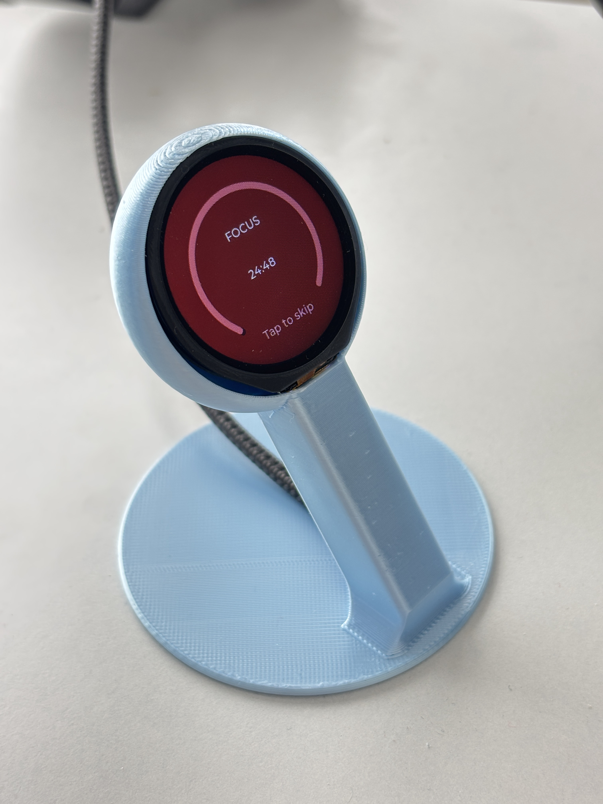
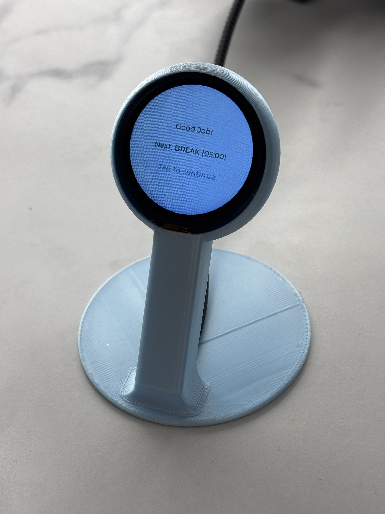
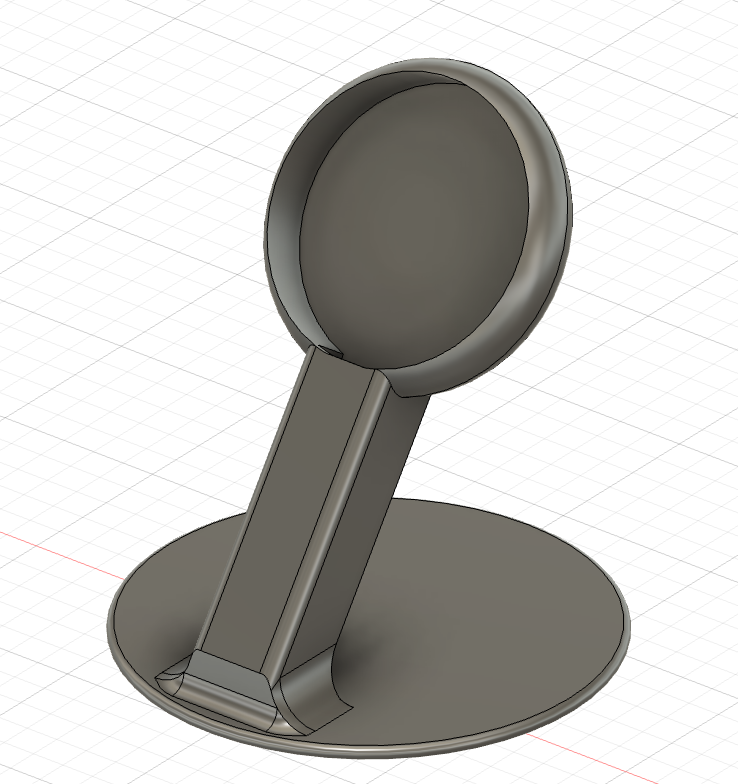
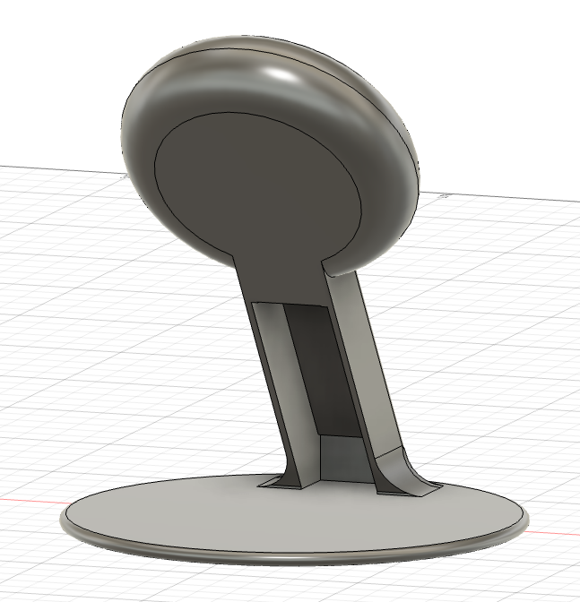

# Desk Pomodoro Timer 🍅
Build your own interactive pomodoro timer for your desk using an ESP32-S3 (touch version with a circular LCD display) and a 3D printed mount. You can build this for about $30, but you'll need a 3D printer.

During break time, the device will even give you a random exercise to do!

The 3D mount is contained in the file `pomodoro_mount.stl` and can be printed using a 3D printer. The mount is designed to be mounted on a desk or table top.

## Getting Started

What you'll need:
 - [A 1.28 inch round ESP32-S3 board with display](https://www.amazon.com/dp/B0CM6JCJ2H)
 - A USB-C cable for power
 - A 3D printer (I used a Bambu A1)

## Installing the software

1. Download and install the [Arduino IDE](https://www.arduino.cc/en/software) if you don't already have it.
2. In the Arduino IDE, go to the Boards Manager tab, and install ESP32 by Espressif Systems, version 2.0.12.
3. Navigate to the Libraries tab, and install the following libraries:
    - LVGL version 8.3.10
    - TFT_eSPI version 2.5.34
4. Connect your ESP32-S3 to your computer using a USB-C cable. If you're on Windows, it might show up as something like "COM3". Change the device type for it to "ESP32S3 Dev Module" in the Device Manager.
5. Open the `LVGL_Arduino_Pomodoro.ino` file in the Arduino IDE.
6. Upload the sketch to your ESP32-S3 by clicking the Upload button (arrow pointing right) in the Arduino IDE.
7. After uploading, your ESP32-S3 should by showing the pomodoro timer screen.

## Printing the mount

1. Open `pomodoro_mount.stl` in your 3D printer software.
2. Default settings should work fine, but you may want to increase the print infill to 50% or more. Supports weren't needed for my printer (Bambu A1), but you might need them for yours.

## Assembly

1. Feed the USB-C cable through the hole in the bottom of the mount.
2. Connect the ESP32-S3 to the USB-C cable.
3. Fit the ESP32-S3 into the mount. This might take some careful adjustment as the screen is meant to fit perfectly flush inside of the circular mount.
4. Enjoy! Connect it to a power source and you're ready to go.

## References

The following source and binary files are originally from the [Waveshare docuemntation for the ESP32-S3 display](https://www.waveshare.com/wiki/ESP32-S3-Touch-LCD-1.28):
 - `CST816S.h`
 - `CTS816S.cpp`
 - `bin/bootloader.bin`
 - `bin/partitions.bin`
 - `bin/LVGL_Arduino.ino.bin`

